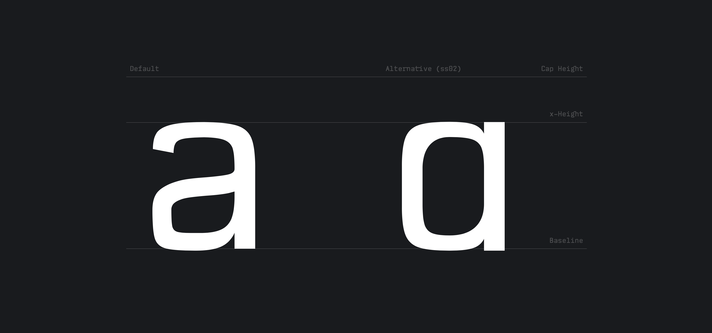
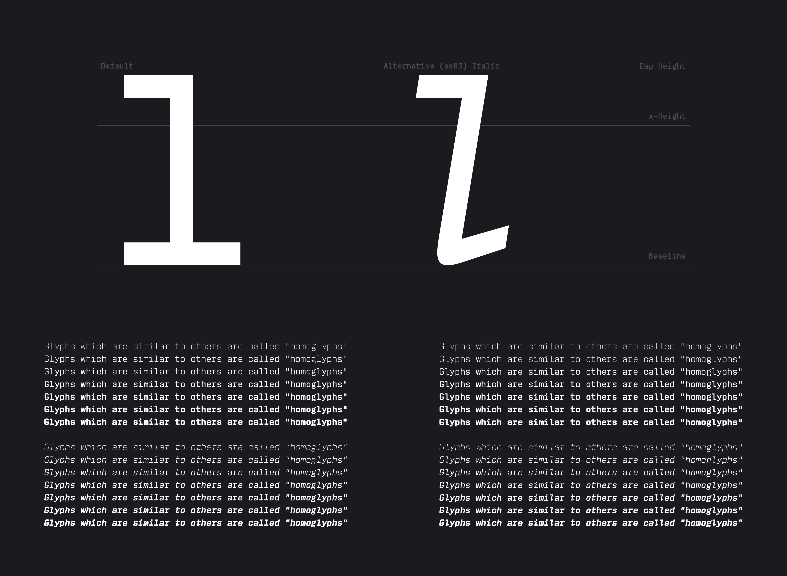
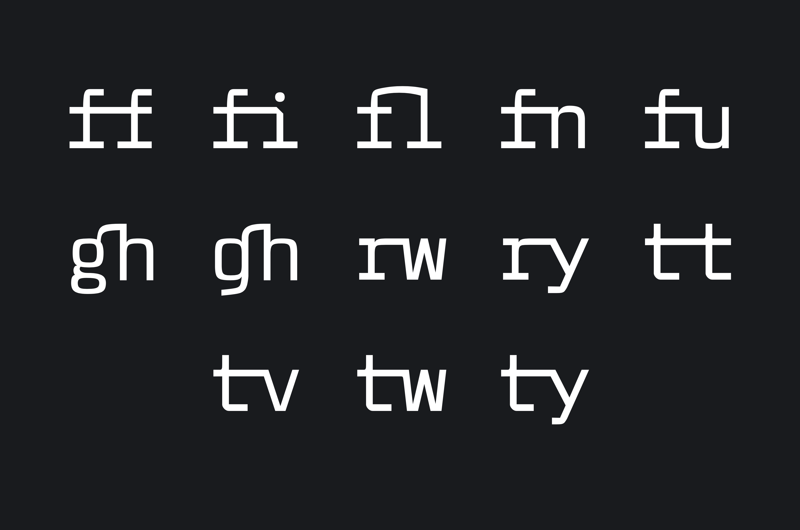

<a href="https://vaughantype.com/wumpus-mono-pro" target="_blank">**Wumpus Mono**</a> is a modern and functional monospaced typeface with a focus on legibility.

Current version: 1.022.

## ¶ Introduction

Wumpus Mono was designed to be easily legible at very small point sizes, and is influenced by typefaces such as IBM's [Plex](https://github.com/IBM/plex) and the wonderful Susan Kare's [Chicago](https://en.wikipedia.org/wiki/Chicago_(typeface)).

Regular 400 Roman


### [OpenType Stylistic Sets](https://learn.microsoft.com/en-us/typography/opentype/spec/features_pt#ssxx)

### `g.ss01` Single-storey (opentail) g


### `a.ss02` Single-storey a




### `l.ss03` Single-footed l



 _(The above shows the 400 Italic, and multiple weights below, which are not available in the evaluation version in this repository.  Please see [the typeface's site](https://vaughantype.com/wumpus-mono-pro) for more information.)_

<hr>

## ¶ Programming with Wumpus Mono

Many of the decisions that were made in the process of designing this typeface were made in consideration of how it might look when writing Perl programs, since that is often what takes up the majority of my screen's real-estate.


Negative space is used to give extra personality to the `i`, `J`, and `j`:


## ¶ What's in a name?

Wumpus Mono is named after my friend [wumpus](https://github.com/wumpus) (the radio astronomer, not Discord's mascot.)  The name comes from [Hunt the Wumpus](https://en.wikipedia.org/wiki/Hunt_the_Wumpus) - a classic text-based adventure game you can play in your terminal.  It is a source of much inspiration.  If you haven't played it yet, you can do so on [Telehack](https://telehack.com).


When asked how many lobes the asterisk should have:
```
wumpus: The number of sidelobes should be similar to astronomy
wumpus: JWST has 6
```

...indeed, the [James Webb Space Telescope](https://webb.nasa.gov/)'s primary mirror panels are hexagons.

Asterisk anatomy has been discussed in brilliant detail by Jonathan Hoefler in his blog post [“House of Flying Reference Marks”](https://www.typography.com/blog/house-of-flying-reference-marks).

## ¶ Ligatures

Wumpus Mono includes the following programming ligatures:


... and the following common ligatures:



## ¶ License

The fonts in this repository are free for personal evaluation purposes.

Wumpus Mono Pro licenses are available for purchase from [vaughantype.com](https://vaughantype.com) and are licensed under the [Standard Vaughan Type End User Font License Version 1.0](https://vaughantype.com/standard-eula/).

Please [contact the author](mailto:fonts@vaughantype.com) for custom licensing if necessary.

<small>Copyright &copy; 2023 T. E. Vaughan // Vaughan Type. All rights reserved.</small>
