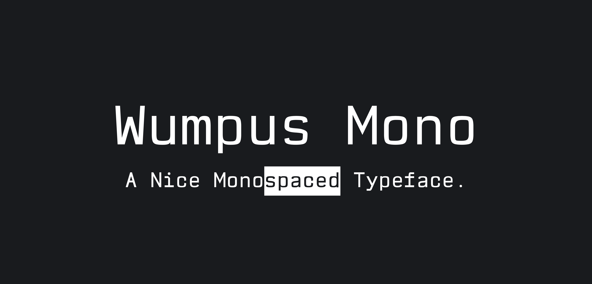
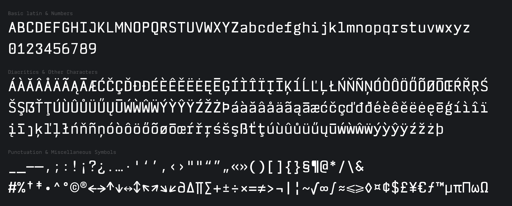
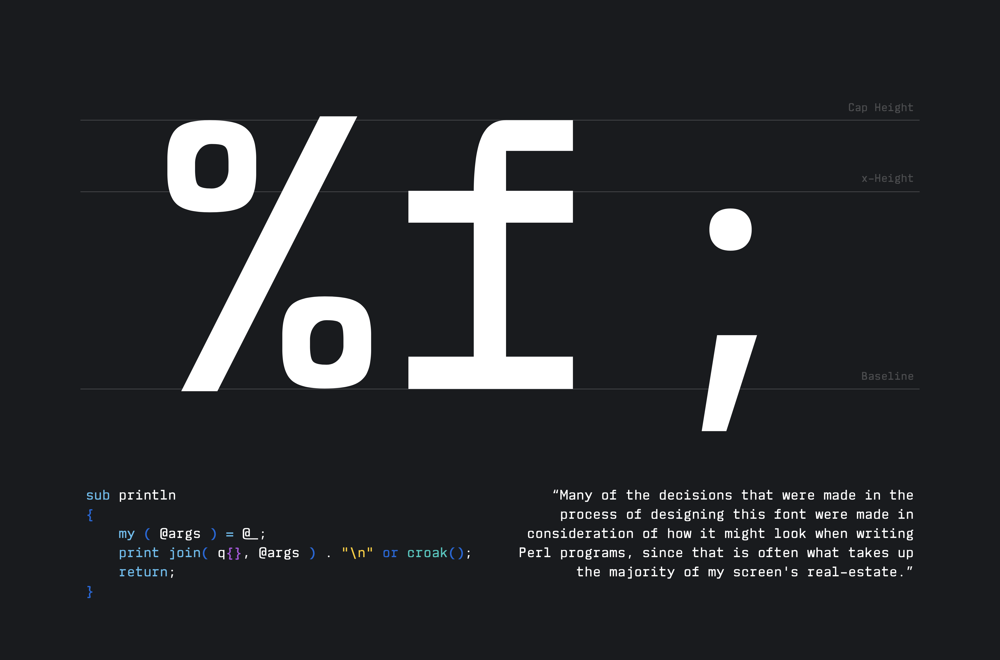
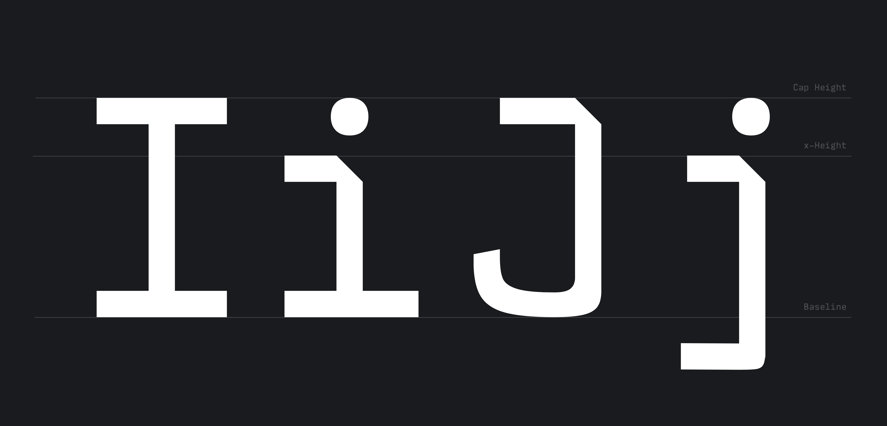
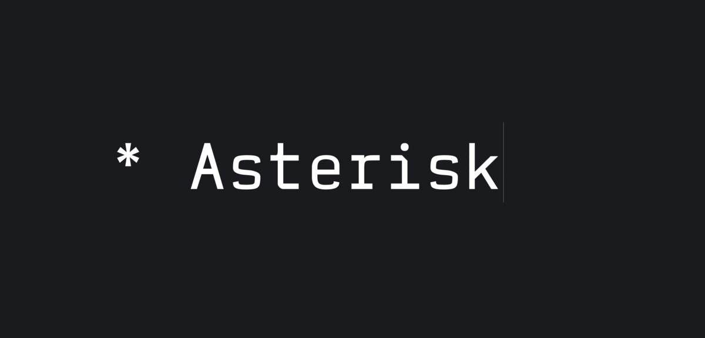
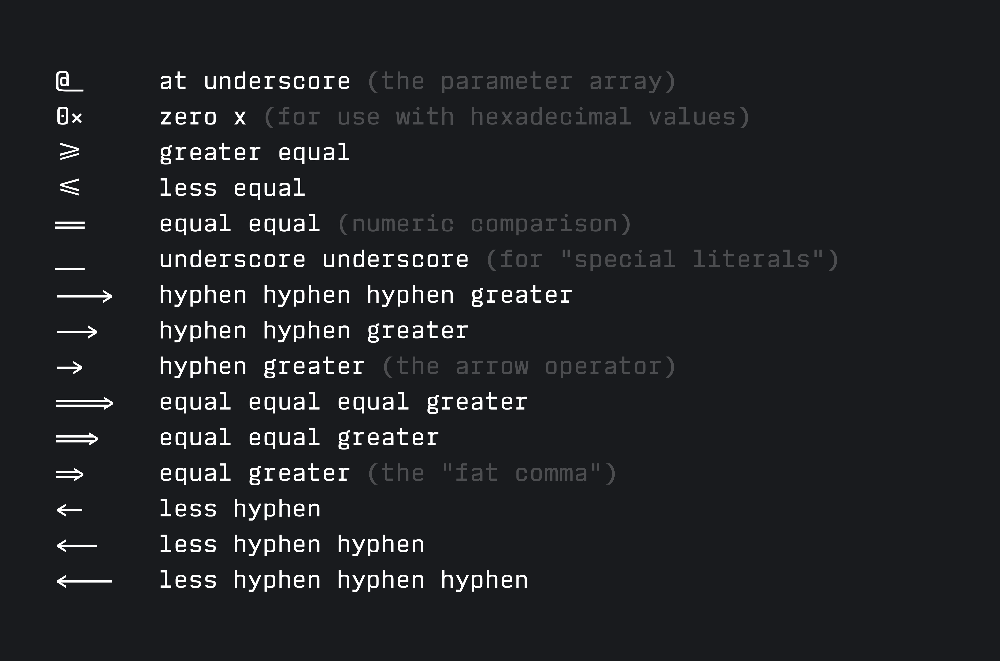

# Wumpus Mono

Wumpus Mono is a modern and functional monospaced typeface with a focus on legibility.

More glyphs and ligatures are planned for future release, along with multiple weights, matching italics, and variable font.

Current version: 1.005.

## ¶ Introduction

Wumpus Mono was designed to be easily legible at very small point sizes, and is influenced by fonts such as IBM's [Plex](https://github.com/IBM/plex) and the wonderful Susan Kare's [Chicago](https://en.wikipedia.org/wiki/Chicago_(typeface)).



Many of the decisions that were made in the process of designing this font were made in consideration of how it might look when writing Perl programs, since that is often what takes up the majority of my screen's real-estate.



Negative space is used to give extra personality to the `i`, `J`, and `j`:



## ¶ What's in a name?

Wumpus Mono is named after my friend [wumpus](https://github.com/wumpus) (the radio astronomer, not Discord's mascot.)  The name comes from [Hunt the Wumpus](https://en.wikipedia.org/wiki/Hunt_the_Wumpus) - a classic text-based adventure game you can play in your terminal.  It is a source of much inspiration.  If you haven't played it yet, you can do so on [Telehack](https://telehack.com).



When asked how many lobes the asterisk should have:
```
wumpus: The number of sidelobes should be similar to astronomy
wumpus: JWST has 6
```

...indeed, the [James Webb Space Telescope](https://webb.nasa.gov/)'s primary mirror panels are hexagons.

Asterisk anatomy has been discussed in brilliant detail by Jonathan Hoefler in his blog post [“House of Flying Reference Marks”](https://www.typography.com/blog/house-of-flying-reference-marks).

## ¶ Ligatures

Wumpus Mono includes the following ligatures:



## ¶ License

Free for personal use. Please [contact the author](mailto:underwood@underwood.network) for commercial licensing.

<small>Copyright &copy; 2013 T. E. Vaughan. All rights reserved.</small>
